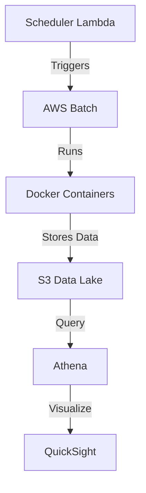

# UK Supermarket Price Scraping Platform

A scalable cloud-native solution for monitoring grocery prices across major UK supermarkets, built with Docker containers and AWS serverless technologies.

## 🚀 Key Features
- **Multi-Supermarket Support**: Simultaneous scraping of Ocado, Tesco, and Aldi.
- **AWS Batch Processing**: Containerized jobs with Fargate Spot instances
- **Data Lake Architecture**: S3 storage with Parquet partitioning
- **Automated Scheduling**: Lambda-driven cron jobs using AWS EventBridge
- **Cost Optimization**: 70% savings through Spot instances and resource right-sizing

## 🛠️ Technical Architecture

##  🌐   Future Roadmap

- Addition of new supermarkets - Sainsburys and Asda
  
- Price change alerts via SNS

- Historical analysis to track long term inflation and compare prices between supermarkets

- ML-powered price prediction and forecasting (SageMaker)

-

